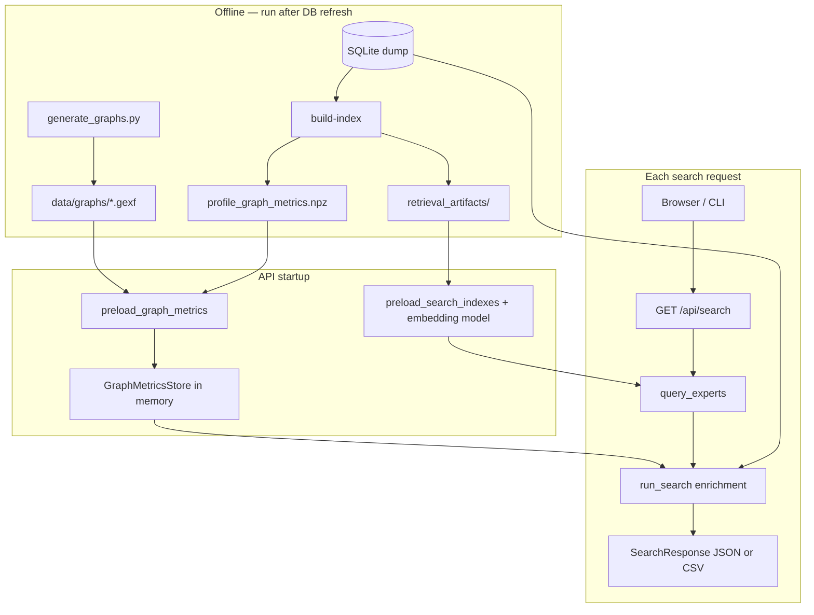

# PolScience documentation

Developer documentation for the expert search system and related tooling. Start here if you are new to the codebase.

## Quick start (5 minutes)

1. Install: `uv sync --extra retrieval --extra api`
2. Download DB: `uv run python data/download_db.py`
3. Build indexes: `uv run python scripts/query_experts.py build-index --db data/LudzieNaukiDumpDB/new_prof_search.sqlite`
4. Run API: set `POLSCIENCE_*` env vars (see [web_api.md](web_api.md)) and `uv run uvicorn src.api.app:app --reload`
5. Open [http://127.0.0.1:8000](http://127.0.0.1:8000)

## What this project does

**PolScience** ranks Polish scientists from the [Ludzie Nauki](https://ludzie.nauka.gov.pl/) dump for a given topic query. It combines:

- **Lexical search** (BM25 over publication titles or profile keywords)
- **Semantic search** (multilingual sentence embeddings)
- **Graph signal** (Personalized PageRank on a co-authorship network, or static PageRank when PPR is off)

Results can be filtered by publication counts, POL-on projects, institution, and academic degree. Optional **graph metric columns** (co-auth degree, network rank, cluster) enrich the UI and CSV export.

## Documentation map

Read in this order if you are onboarding:

| Doc | Audience | Contents |
|-----|----------|----------|
| **[expert_retrieval_fusion.md](expert_retrieval_fusion.md)** | Product / tuning | What the system does, defaults, CLI flags, hyperparameters |
| **[expert_retrieval_code.md](expert_retrieval_code.md)** | Backend developers | Module-by-module walkthrough, build/query pipeline, artifacts |
| **[web_api.md](web_api.md)** | API / frontend developers | HTTP endpoints, request params, response shape, UI behaviour |
| **[graph_metrics_search.md](graph_metrics_search.md)** | Graph / enrichment | GEXF vs search graph, build-index metrics, column naming |

Academic write-ups (LaTeX): `report.tex`, `presentation.tex` in this folder.

## Repository layout

```
PolScience/
├── scripts/query_experts.py     # CLI: build-index, query
├── src/
│   ├── api/                     # FastAPI app, web UI, search orchestration
│   │   ├── app.py               # Routes, startup lifespan, query param parsing
│   │   ├── search_service.py    # Fusion call + DB enrichment + CSV export
│   │   ├── schemas.py           # Pydantic response models
│   │   └── static/              # index.html, app.js, styles.css
│   ├── retrieval/               # Core ranking engine (shared by CLI and API)
│   │   ├── pipeline.py          # build_artifacts, query_experts, index preload
│   │   ├── corpus.py            # SQLite → searchable text per scientist
│   │   ├── bm25_index.py        # Lexical index
│   │   ├── embeddings.py        # Sentence-transformer vectors
│   │   ├── coauth_graph.py      # Co-authorship adjacency matrix
│   │   ├── ppr.py               # Personalized PageRank
│   │   ├── fusion.py            # Score combination
│   │   ├── filters.py           # Structural filters (pubs since year, etc.)
│   │   └── graph_metrics.py     # GEXF + build-index network metrics
│   ├── generate_graphs.py       # Offline GEXF export (separate from search graph)
│   └── graph/                   # Publication-level graph utilities (not used by PPR)
├── data/
│   ├── LudzieNaukiDumpDB/       # SQLite dump (downloaded)
│   ├── retrieval_artifacts/     # Built indexes (gitignored)
│   └── graphs/                  # GEXF files (gitignored)
├── tests/                       # pytest / unittest
└── docs/                        # You are here
```

## End-to-end data flow



## Two co-authorship graphs (important)

The codebase uses **two different graphs**. Do not confuse them:

| | Search graph | GEXF export graph |
|---|--------------|-------------------|
| **Built by** | `build-index` → `coauth_edges.npz` | `generate_graphs.py` |
| **Used for** | PPR at query time; build-index degree/PageRank | Cluster labels; optional institution metrics |
| **Scope** | All indexed non-stub profiles | Often domain-filtered subsets |
| **Module** | `coauth_graph.py`, `ppr.py` | `graph_metrics.py` (load only) |

See [graph_metrics_search.md](graph_metrics_search.md) for how metrics from both sources are merged at API startup.

## Environment variables

| Variable | Default | Purpose |
|----------|---------|---------|
| `POLSCIENCE_DB_PATH` | `data/LudzieNaukiDumpDB/new_prof_search.sqlite` | Profile names, filter SQL, enrichment |
| `POLSCIENCE_ARTIFACTS_DIR` | `data/retrieval_artifacts` | BM25, embeddings, co-auth graph |
| `POLSCIENCE_GRAPHS_DIR` | `data/graphs` | GEXF files for graph columns |
| `POLSCIENCE_EAGER_LOAD` | off | Run probe queries at startup (warmer, slower boot) |

## Tests

```bash
uv run pytest                    # full suite (~150 tests)
uv run pytest tests/test_api.py  # API only
```

Key test files:

- `test_retrieval_fusion.py` — fusion, PPR, modes (in-memory SQLite)
- `test_api.py` — HTTP layer with mocked `query_experts`
- `test_gexf_metrics.py`, `test_profile_graph_metrics.py` — graph metrics loading and merge
- `test_filters.py` — structural filter SQL

## Common tasks

| Task | Command / file |
|------|----------------|
| Rebuild after DB update | `query_experts.py build-index` |
| Change indexed text | Edit `corpus.py`, rebuild |
| Change fusion formula | Edit `fusion.py` |
| Add API query parameter | `app.py` `get_search_params` + `SearchParams` in `search_service.py` |
| Add result column | `schemas.py` `ExpertResult`, `search_service.py` `_result_column_specs`, `app.js` table builders |
| Regenerate GEXF | `uv run python src/generate_graphs.py --db ...` |

## Getting help

- **Behaviour / tuning:** [expert_retrieval_fusion.md](expert_retrieval_fusion.md)
- **Where code lives:** [expert_retrieval_code.md](expert_retrieval_code.md)
- **HTTP contract:** [web_api.md](web_api.md)
- **Graph columns:** [graph_metrics_search.md](graph_metrics_search.md)
