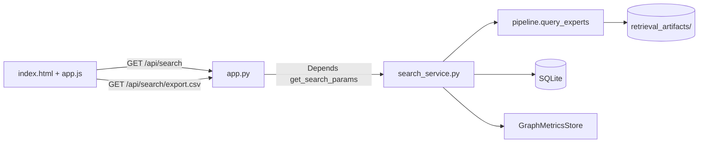
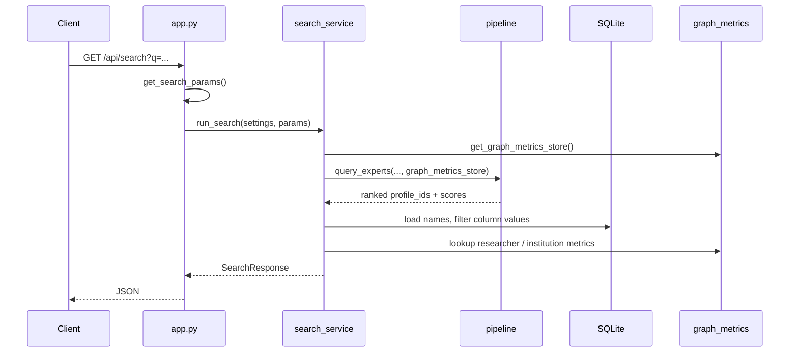

# Web API and UI

**Related:** [expert_retrieval_fusion.md](expert_retrieval_fusion.md) · [expert_retrieval_code.md](expert_retrieval_code.md) · [graph_metrics_search.md](graph_metrics_search.md)

This document describes the FastAPI application in `src/api/`: how to run it, what each endpoint returns, and how the browser UI maps to the backend.

---

## 1. Architecture



| Module | Responsibility |
|--------|----------------|
| [`app.py`](../src/api/app.py) | FastAPI app, lifespan (preload), routes, query-parameter validation |
| [`search_service.py`](../src/api/search_service.py) | Calls fusion pipeline, loads display fields from DB, builds CSV |
| [`schemas.py`](../src/api/schemas.py) | Pydantic models for JSON responses |
| [`config.py`](../src/api/config.py) | Paths and flags from environment |
| [`enrichment.py`](../src/api/enrichment.py) | Name, email, Ludzie profile URL per `profile_id` |
| [`profile_urls.py`](../src/api/profile_urls.py) | URL slug: `ln/profiles/{given}.{surname}.{id}` |
| [`static/app.js`](../src/api/static/app.js) | Form → query string, table rendering, CSV download link |
| [`static/index.html`](../src/api/static/index.html) | Search form, advanced filters, results table |

The API layer is thin: almost all ranking logic lives in `src/retrieval/` and is shared with the CLI (`scripts/query_experts.py`).

---

## 2. Running the server

```bash
export POLSCIENCE_DB_PATH=data/LudzieNaukiDumpDB/new_prof_search.sqlite
export POLSCIENCE_ARTIFACTS_DIR=data/retrieval_artifacts
export POLSCIENCE_GRAPHS_DIR=data/graphs   # optional; omit if no GEXF files

uv run uvicorn src.api.app:app --reload --host 0.0.0.0 --port 8000
```

Open [http://127.0.0.1:8000](http://127.0.0.1:8000).

**Prerequisite:** run `build-index` at least once so `retrieval_artifacts/` exists.

### Startup sequence (`lifespan` in `app.py`)

1. Load settings from environment.
2. If artifacts exist: resolve embedding model name, preload model, preload **both** search-mode indexes (BM25 + embeddings + shared co-auth graph).
3. Load graph metrics: merge GEXF files from `POLSCIENCE_GRAPHS_DIR` with `profile_graph_metrics.npz` from artifacts (if present).
4. Optionally (`POLSCIENCE_EAGER_LOAD=1`): run a tiny search in each mode to warm fusion code paths.

Both search modes stay in memory after startup so switching `mode=publications` ↔ `mode=profile` does not reload indexes from disk.

---

## 3. Endpoints

### `GET /`

Serves the web UI (`static/index.html` via Jinja2).

### `GET /api/health`

Returns readiness of database, artifacts, and graph directory.

```json
{
  "ok": true,
  "db": true,
  "artifacts": true,
  "graphs": true,
  "db_path": "/path/to/new_prof_search.sqlite",
  "artifacts_dir": "/path/to/retrieval_artifacts",
  "graphs_dir": "/path/to/graphs"
}
```

- `ok` is `true` only when both DB and artifacts are present.
- `graphs` is `true` when the graphs directory exists **and** contains at least one `.gexf` file.

### `GET /api/search`

Runs a search and returns JSON (`SearchResponse`).

### `GET /api/search/export.csv`

Same query parameters as `/api/search`. Returns UTF-8 CSV with BOM (Excel-friendly Polish diacritics). Filename: `experts_{mode}.csv`.

---

## 4. Query parameters

All search endpoints share one dependency: **`get_search_params()`** in `app.py`. Parameters are declared once; both JSON and CSV routes use `Depends(get_search_params)`.

### Core

| Parameter | Type | Default | Description |
|-----------|------|---------|-------------|
| `q` | string | **required** | Topic query (Polish or English) |
| `mode` | string | `publications` | `publications` or `profile` |
| `top` | int | 1000 | Max results (1–5000) |

### Fusion tuning

| Parameter | Type | Default | Description |
|-----------|------|---------|-------------|
| `recall_k` | int | 5000 | BM25 candidate pool size |
| `seed_k` | int | 200 | Top BM25 hits used as PPR seeds |
| `w_bm25` | float | 0.25 | Keywords weight (renormalized with others) |
| `w_embed` | float | 0.55 | Semantic weight |
| `w_ppr` | float | 0.20 | Community / graph weight |
| `gate_bm25` | bool | false | Penalize high graph score when BM25 is low |
| `ppr_alpha` | float | 0.85 | PPR restart probability (0–1) |
| `disable_ppr` | bool | false | Skip query-time PPR; may use static PageRank in fusion if GEXF loaded |

### Structural filters

Applied **after** BM25 recall, before fusion reranking. Profiles that fail a filter are removed from the candidate pool.

| Parameter | Type | Description |
|-----------|------|-------------|
| `min_pubs` | int | Minimum total publications |
| `domain_code` | string | Ludzie Nauki domain code |
| `min_year` | int | At least one publication in or after this year |
| `min_pubs_since` + `since_year` | int pair | **Both required together.** Min publications since `since_year` |
| `min_polon_projects` + `projects_since_year` | int pair | **Both required together.** Min POL-on projects since year |
| `institution_id` | string (repeatable) | Institution UUID; comma-separated also accepted |
| `institution_name` | string (repeatable) | Substring match on current institution name |
| `min_degree_mgr` | bool | Require degree ≥ MGR (master or higher) |

Validation errors return HTTP 400 with a clear message (e.g. paired params, empty `q`, unknown `mode`).

---

## 5. JSON response

### Top-level `SearchResponse`

| Field | Meaning |
|-------|---------|
| `query` | Echo of search text |
| `search_mode` | `publications` or `profile` |
| `count` | Number of results returned |
| `weights` | Normalized fusion weights actually used (`keywords`, `semantic`, `community`) |
| `filter_columns` | Which optional filter columns are shown (see below) |
| `graph_metrics` | `true` if graph metric columns are available |
| `static_network_fusion` | `true` when PPR disabled and static co-auth PageRank used in fusion |
| `show_community_column` | `false` when `disable_ppr=true` (Community score hidden; Network rank column covers static case) |
| `results` | List of `ExpertResult` |

### `FilterColumnsApplied`

Present when at least one structural filter is active. Drives **extra table/CSV columns**:

| Field | When set | Column added |
|-------|----------|--------------|
| `pubs_since_year` | `min_pubs_since` filter used | `Pubs since {year}` |
| `projects_since_year` | `min_polon_projects` filter used | `Projects since {year}` |
| `institutions` | institution filter used | `Institutions` (current names) |
| `degree` | `min_degree_mgr` used | `Degree` label |

### `ExpertResult` (each row)

| Field | Always | Notes |
|-------|--------|-------|
| `rank`, `profile_id`, `name`, `email`, `profile_url` | ✓ | Display fields from SQLite + URL builder |
| `final`, `bm25`, `cosine`, `ppr` | ✓ | Fusion and component scores |
| `pubs_since_year`, `projects_since_year` | filter-dependent | Counts for active since-year filters |
| `institutions`, `degree` | filter-dependent | Human-readable filter context |
| `coauth_degree`, `network_pagerank`, `cluster_name` | when `graph_metrics=true` | See [graph_metrics_search.md](graph_metrics_search.md) |
| `institution_network_pagerank` | graph + institution filter | Max institution PageRank among matched filter institutions |

Score fields in JSON are raw floats. CSV export formats scores as 6 decimal places.

---

## 6. CSV export

CSV columns are built by **`_result_column_specs()`** in `search_service.py` — a single source of truth for header names and cell values. The web UI table uses parallel logic in `app.js` (`appendFilterAndGraphHeaders`, `appendFilterAndGraphCells`).

Base columns (always):

`rank`, `profile_id`, `name`, `email`, `profile_url`, `final`, `keywords`, `semantic`

Optional columns follow the same rules as the UI (community column, filter columns, graph columns). Keeping CSV and table in sync: when adding a column, update both `_result_column_specs` and `app.js`.

---

## 7. Request flow (one search)



Inside `query_experts` (see [expert_retrieval_code.md](expert_retrieval_code.md)):

1. BM25 → top `recall_k` candidates  
2. Apply structural filters  
3. Encode query; cosine similarity on pool  
4. PPR (or static PageRank from graph store when PPR disabled)  
5. `fuse_scores` → top `top_k`

---

## 8. Web UI behaviour

The UI is a static single-page form — no build step.

| File | Role |
|------|------|
| `index.html` | Form fields, advanced filters fieldset, empty results table |
| `app.js` | Validates paired filter fields client-side, builds query string, renders dynamic table headers |
| `styles.css` | Layout and table styling |

Important UI rules (mirrored server-side):

- `min_pubs_since` and `since_year` must both be filled or both empty.
- Same for `min_polon_projects` and `projects_since_year`.
- **Community** column label changes when `disable_ppr` is checked (static PageRank vs PPR).
- **Download CSV** reuses the last search query string against `/api/search/export.csv`.

---

## 9. Error codes

| Code | Typical cause |
|------|----------------|
| 400 | Empty query, invalid mode, unpaired filter params, unmatched institution name |
| 503 | Database or artifacts missing; index files not found |

---

## 10. Extending the API

| Change | Files to touch |
|--------|----------------|
| New query parameter | `get_search_params` in `app.py`, `SearchParams` dataclass, pass through to `query_experts` in `search_service.py`, optionally `app.js` form |
| New response field | `ExpertResult` in `schemas.py`, enrichment in `search_service.run_search`, `_result_column_specs` if CSV column, `app.js` renderers |
| New filter | `filters.py` + corpus `meta`, then wire param in app and UI |

Interactive API docs (when server is running): [http://127.0.0.1:8000/docs](http://127.0.0.1:8000/docs) (FastAPI auto-generated OpenAPI).
