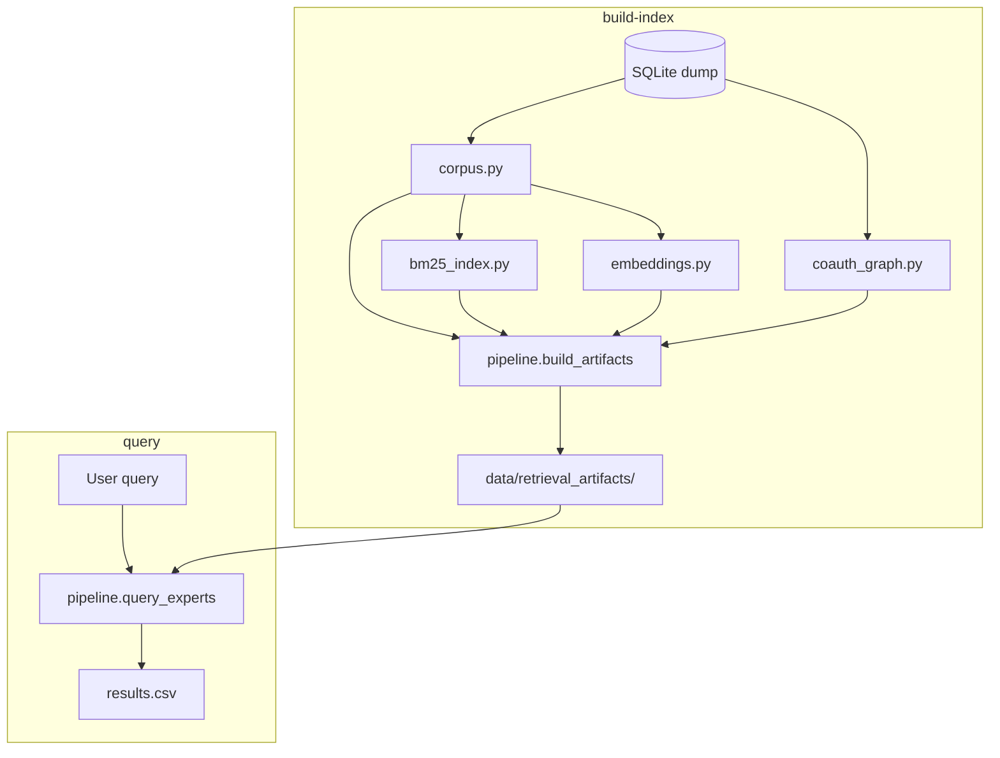
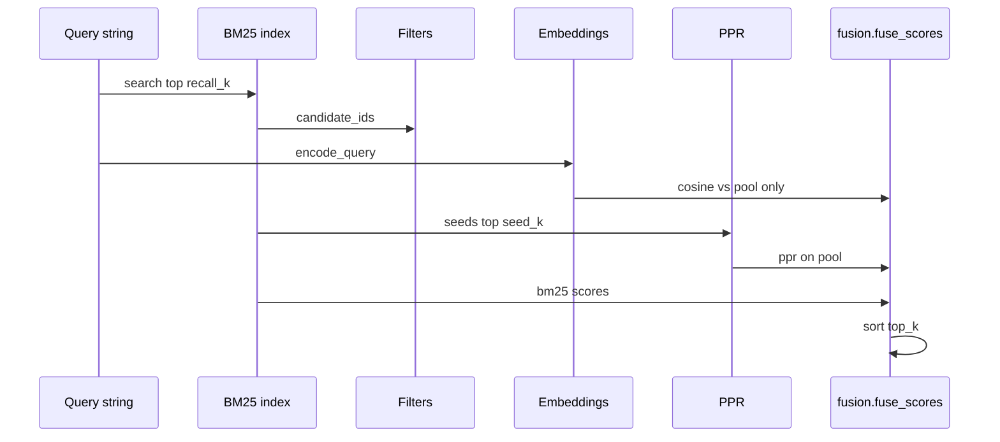

# Expert retrieval — how the code works

This document explains the **implementation** behind [expert_retrieval_fusion.md](expert_retrieval_fusion.md) (product defaults and CLI). Read that doc for *what to run*; read this one for *how the Python code is organized*.

---

## 1. Big picture

The system answers: **given a text query, which scientists should we poll?**

It does **not** train a custom neural model. It:

1. Builds **offline indexes** from the Ludzie Nauki SQLite dump.
2. At query time, **retrieves** a wide candidate pool, then **reranks** with semantic embeddings and a co-authorship graph.



**Entry points**

| What | Where |
|------|--------|
| CLI | [`scripts/query_experts.py`](../scripts/query_experts.py) |
| Orchestration | [`src/retrieval/pipeline.py`](../src/retrieval/pipeline.py) |
| Public API | [`src/retrieval/__init__.py`](../src/retrieval/__init__.py) |

---

## 2. Search modes (two different “documents” per scientist)

[`src/retrieval/modes.py`](../src/retrieval/modes.py) defines `SearchMode`:

| Mode | Indexed text | Use when |
|------|----------------|----------|
| `publications` | Paper **titles** + keywords + domain/specialty labels | Query mentions concrete research topics / paper wording |
| `profile` | Keywords, domains, specialties, **institutions**, about-me — **no titles** | Broad field terms; user does not know exact Ludzie Nauki taxonomy |

Each mode has its **own** `corpus.jsonl`, BM25 pickle, and embedding matrix under:

```
data/retrieval_artifacts/
  publications/
  profile/
  profile_id_index.json    # shared row order
  coauth_edges.npz           # shared graph
```

PPR and the graph are **shared** across modes; only the text indexes differ.

---

## 3. Module-by-module

### 3.1 `corpus.py` — SQLite → one string per scientist

**Job:** Load relational data once (`_load_profile_bundle`), then assemble a single searchable `text` per `profile_id`.

**Flow:**

```
profiles (is_stub=0)
  → titles via authorship + publications
  → profile_keywords + keywords
  → scientific_domains, disciplines, specialties
  → institutions (profile_institutions, memberships)
  → about_me, degree_titles
  → _assemble_publications_text OR _assemble_profile_text
  → ScientistDocument(profile_id, text, meta)
```

- **`meta`** holds `pub_count`, `max_year`, `domain_code` for CLI filters (`--min-pubs`, `--domain-code`, `--min-year`).
- Text is capped (`MAX_TEXT_CHARS`, `MAX_TITLES`) so indexes stay bounded.
- Optional tables are skipped safely if missing (`_table_exists`).

**Artifacts:** `corpus.jsonl` (one JSON object per line).

---

### 3.2 `bm25_index.py` — lexical recall

**Job:** BM25Okapi over tokenized corpus ([`tokenize`](src/retrieval/corpus.py): lowercase alphanumeric tokens).

- **Build:** tokenize every document → `BM25Okapi` → pickle `bm25_index.pkl`.
- **Search:** score all documents, return top `recall_k` (default 5000) `(profile_id, score)`.

BM25 is the **wide funnel**: everything later only sees scientists BM25 surfaced (plus filters).

---

### 3.3 `embeddings.py` — semantic rerank (bi-encoder)

**Job:** `sentence-transformers` encodes each scientist’s `text` into a unit vector; at query time encodes the query once.

- Vectors stored as `embeddings.f32.npy` (row `i` = `profile_id_index[i]`).
- Cosine similarity = dot product (embeddings are L2-normalized).
- Scores computed **only for BM25 candidates** (not full 150k dot products at query time if pool ≪ corpus).

Default model: `paraphrase-multilingual-MiniLM-L12-v2` (PL + EN).

---

### 3.4 `coauth_graph.py` — scientist–scientist edges

**Job:** Undirected weighted graph:

- **Node** = indexed non-stub profile.
- **Edge** = co-authored ≥1 paper; **weight** = number of shared publications.

SQL pairs `(profile_id_a, profile_id_b)` with `a < b`, then mirrors edges for undirected adjacency.

Saved as sparse CSR matrix `coauth_edges.npz`. This is **independent** of [`src/graph/publication_graph.py`](../src/graph/publication_graph.py), which links *publications* via shared authors (local neighborhoods).

---

### 3.5 `ppr.py` — Personalized PageRank

**Job:** Spread “relevance mass” from **seed** scientists along co-authorship edges.

1. **Seeds:** top `seed_k` BM25 hits; personalization mass ∝ BM25 score.
2. **Walk:** row-normalized adjacency; with probability `alpha` (0.85) jump back to personalization vector.
3. **Output:** stationary distribution; we read scores only for **BM25 pool** indices.

PPR does **not** understand the query text — it only amplifies scientists **network-close** to strong lexical matches.

Isolated scientists (no co-authors) get a self-loop so the walk does not die.

---

### 3.6 `fusion.py` — combine three signals

For each candidate in the BM25 pool:

1. Min-max normalize `bm25`, `cosine`, `ppr` **within the pool** (0–1).
2. Weighted sum: `w_bm25 * bm25 + w_embed * cosine + w_ppr * ppr` (weights renormalized to sum 1).
3. Optional `--gate-bm25`: `final *= (ε + norm_bm25)` so high PPR cannot rescue near-zero text match.

Returns sorted `(profile_id, final, {bm25, cosine, ppr})`.

---

### 3.7 `pipeline.py` — glue

**`build_artifacts(db_path, artifacts_dir, modes=...)`**

For each `SearchMode`:

1. `build_scientist_corpus` → save `corpus.jsonl`
2. `build_bm25_index` → `bm25_index.pkl`
3. `build_embeddings` → `embeddings.f32.npy`

Then **once** (shared):

4. `profile_id_index.json` from reference mode (usually `publications`)
5. `export_coauth_edges` → `coauth_edges.npz`
6. `build_manifest.json` with timings and counts

**`query_experts(artifacts_dir, query, search_mode=...)`**



---

### 3.8 `logging_config.py`

Build-only logging to stderr (`polscience.retrieval.build`):

- `configure_build_logging()` — called from CLI on `build-index`
- `log_step` — context manager: `▶ step` / `✓ step done in Xs`
- `log_progress` — periodic counters (e.g. co-auth pairs every 100k)

Query path is mostly silent unless you add logging later.

---

## 4. Artifact layout (on disk)

```
data/retrieval_artifacts/
├── build_manifest.json
├── profile_id_index.json      # ["id1", "id2", ...] row order for graph + embeddings
├── coauth_edges.npz
├── coauth_graph_meta.json
├── publications/
│   ├── corpus.jsonl
│   ├── bm25_index.pkl
│   ├── embeddings.f32.npy
│   └── embeddings_meta.json
└── profile/
    └── (same four files)
```

**Legacy:** flat `corpus.jsonl` at artifact root is still treated as `publications` mode ([`resolve_mode_dir`](src/retrieval/corpus.py)).

---

## 5. Query path (step by step)

When you run:

```bash
uv run python scripts/query_experts.py query --search-mode profile --query "..." --top 1000
```

1. Resolve `artifacts_dir/profile/` (or `publications/`).
2. Load BM25, embeddings, co-auth graph, corpus meta.
3. `bm25.search(query, top_k=5000)` → ordered hits.
4. Filter hits by `meta` (stub already excluded at index time).
5. Encode query; dot-product against embedding rows for **filtered pool only**.
6. PPR on full graph with seeds from top 200 BM25; extract scores for pool nodes.
7. `fuse_scores` → take top 1000 → write CSV with `rank, profile_id, final, bm25, cosine, ppr`.

---

## 6. Extending the system

| Change | Touch |
|--------|--------|
| Add abstract text to index | `corpus.py` `_assemble_publications_text` + rebuild |
| New search mode | `modes.py`, assembly function in `corpus.py`, `build_artifacts` loop |
| Different fusion formula | `fusion.py` |
| Different graph (citations, same institution) | `coauth_graph.py` SQL + rebuild |
| Fine-tuned embeddings | `embeddings.py` model name + rebuild |
| HTTP API | Thin wrapper around `query_experts` |

---

## 7. Tests

[`tests/test_retrieval_fusion.py`](../tests/test_retrieval_fusion.py) — in-memory SQLite:

- Corpus includes titles + keywords; profile mode excludes titles
- BM25 ordering smoke test
- PPR boosts neighbor of seed
- Fusion weight behavior

No GPU / no full DB in CI.

---

## 8. Related code (outside `src/retrieval/`)

| File | Role |
|------|------|
| [`src/graph/publication_graph.py`](../src/graph/publication_graph.py) | Publication-level shared-author neighborhoods (not used by PPR) |
| [`data/assess_jepa_feasibility.py`](../data/assess_jepa_feasibility.py) | Data-quality gate before JEPA |
| [`docs/jepa.md`](jepa.md) | Future trajectory model (needs abstracts) |
